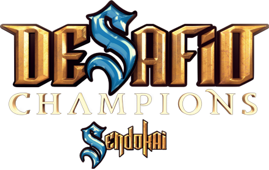

  
  
  # Sendokai Champions Subtitles
  
  **Recreating English subtitles for the beloved animated series**
  
  
  
  
  
  

---

## 🎬 About This Project

Welcome to the Sendokai Champions Subtitles project! This repository aims to recreate English subtitles for the animated series "Sendokai Champions" (also known as *Desafio Champions Sendokai*). This open-source repository is a place where fans and volunteers can contribute to making the show accessible to English-speaking audiences.

## 📺 Background & Premise

[**Sendokai Champions**](http://www.sendokaichampions.com/) (Known as *Desafio Champions Sendokai* in Spanish) is an animated series developed by Kotoc Productions and produced by RTVE, Planeta Junior, and Kotoc. Aired in 2013, the show debuted with many official dubs including Spanish (The main language), English, and [even Arabic!](https://www.arabic-toons.com/m7arbi-sendokai-1434722187-11103.html#sets).

### 🚨 The Lost Media Crisis

However, the English dub is now considered ***Lost Media*** after being taken down from their [Official YouTube Channel](https://www.youtube.com/@SendokaiChampionsEnglish), with no other official hosting. The production team had slowly been uploading the English dubs to their [Official YouTube Channel](https://www.youtube.com/@SendokaiChampionsEnglish), until one day everything was taken down without any explanation.

Currently the only readily available dub of the series is the Spanish version, which is found on their [Official YouTube Channel](https://www.youtube.com/@SendokaiChampions). ~~The entirety of Season 1 in English was archived and uploaded to an [Unofficial YouTube Channel](https://www.youtube.com/@sendokaichampions7678)~~ This was taken down recently as well, however finding Season 2 is much more challenging. Since the production team had only uploaded the first 6 episodes of Season 2, the rest of the episodes are considered lost media. Those 6 episodes can be found on the depths of KissCartoon or BilliBilli, but their quality leaves much to be desired.

### Our Mission

This project aims to recreate the English subtitles for the entire series, so that fans can enjoy the show in English once again!

## Current Progress

Currently, I'm working on creating English Subtitles based on the Spanish Dub for Season 2. Once I finish that, I'm considering creating Arabic subtitles for the redacted scenes in the Arabic Dub (Many of Zach, Chloe, and Lon's Scenes were redacted in the Arabic Dub due to them being considered inappropriate for the region). If you're interested in helping out, feel free to claim an episode in the `Issues` tab!

### Status Legend

| Status | Meaning | Description |
|--------|---------|-------------|
| 🟩 | **Completed** | The subtitles for this particular episode are complete and ready to be used |
| 🟦 | **Abandoned** | The subtitles for this particular episode are incomplete, and the person working on them has abandoned the project. If you're interested in helping out, feel free to claim it in the `Issues` tab! |
| 🟨 | **In Progress** | Someone has claimed this episode and is currently working on it. Check the `Issues` tab to see who's working on it! |
| 🟥 | **Not Started** | No one has claimed this episode yet. If you're interested in helping out, feel free to claim it in the `Issues` tab! |

> **📝 Note:** Episodes marked with \* have a surviving English dub, and are much easier to subtitle. It's recommended to leave these episodes for last, as they're the easiest to subtitle. It may not end up being necessary to subtitle them at all, as the English dub is already available.

---

### 🎥 Season 2

  

| Episode | Title | Status | Contributor |
|---------|-------|--------|-------------|
| 27 | [A Good Story*](./s2/en/27%20-%20A%20Good%20Story.en.srt) | 🟩 | Ibrahim Chehab |
| 28 | [A New Adventure*](./s2/en/28%20-%20A%20New%20Adventure.en.srt) | 🟩 | Ibrahim Chehab |
| 29 | [Danima*](./s2/en/29%20-%20Danima.en.srt) | 🟩 | Ibrahim Chehab |
| 30 | [Yakis*](./s2/en/30%20-%20Yakis.en.srt) | 🟩 | Ibrahim Chehab |
| 31 | [Trust Us, Lon](./s2/en/31%20-%20Trust%20Us,%20Lon.en.srt) | 🟩 | Ryan Khan and Ibrahim Chehab |
| 32 | [Kido the Destroyer*](./s2/en/32%20-%20Kido%20the%20Destroyer.en.srt) | 🟩 | Ibrahim Chehab |
| 33 | [Babysitter](./s2/en/33%20-%20Babysitter.en.srt) | 🟥 | - |
| 34 | [An Unbreakable Team](./s2/en/34%20-%20An%20Unbreakable%20Team.en.srt) | 🟥 | - |
| 35 | [Duo-Sen Lightning Bolt](./s2/en/35%20-%20Duo-Sen%20Lightning%20Bolt.en.srt) | 🟥 | - |
| 36 | [A Good Leader](./s2/en/36%20-%20A%20Good%20Leader.en.srt) | 🟥 | - |
| 37 | [Uncertain Times](./s2/en/37%20-%20Uncertain%20Times.en.srt) | 🟥 | - |
| 38 | [I'll Never Forget You](./s2/en/38%20-%20I'll%20Never%20Forget%20You.en.srt) | 🟥 | - |
| 39 | [Stupid Sendokai](./s2/en/39%20-%20Stupid%20Sendokai.en.srt) | 🟥 | - |
| 40 | [The First Great Tournament](./s2/en/40%20-%20The%20First%20Great%20Tournament.en.srt) | 🟨 | Ibrahim Chehab |
| 41 | [The Norkingos](./s2/en/41%20-%20The%20Norkingos.en.srt) | 🟩 | Ibrahim Chehab |
| 42 | [A Hero For Masara](./s2/en/42%20-%20A%20Hero%20For%20Masara.en.srt) | 🟩 | Ibrahim Chehab |
| 43 | [You Are Alone](./s2/en/43%20-%20You%20Are%20Alone.en.srt) | 🟩 | Ibrahim Chehab |
| 44 | [Friends and Rivals](./s2/en/44%20-%20Friends%20and%20Rivals.en.srt) | 🟩 | Ibrahim Chehab |
| 45 | [May The Best Team Win](./s2/en/45%20-%20May%20The%20Best%20Team%20Win.en.srt) | 🟩 | Ibrahim Chehab |
| 46 | [Traitors](./s2/en/46%20-%20Traitors.en.srt) | 🟩 | Ibrahim Chehab |
| 47 | [The Twilight of the Hakuru](./s2/en/47%20-%20The%20Twilight%20of%20the%20Hakuru.en.srt) | 🟩 | Ibrahim Chehab |
| 48 | [The Hour of Truth](./s2/en/48%20-%20The%20Hour%20of%20Truth.en.srt) | 🟩 | Ibrahim Chehab |
| 49 | [The Power of the Baron](./s2/en/49%20-%20The%20Power%20of%20the%20Baron.en.srt) | 🟩 | Ibrahim Chehab |
| 50 | [The Great Zorn](./s2/en/50%20-%20The%20Great%20Zorn.en.srt) | 🟩 | Ibrahim Chehab |
| 51 | [Rise of the Hakuru](./s2/en/51%20-%20Rise%20of%20the%20Hakuru.en.srt) | 🟩 | Ibrahim Chehab |
| 52 | [Something in Common](./s2/en/52%20-%20Something%20in%20Common.en.srt) | 🟩 | Ibrahim Chehab |

### 🎥 Sengate

  

| Content | Language | Status | Contributor |
|---------|----------|--------|-------------|
| [Sengate - English Subs](./sengate/en/Sendokai%20Champions%20-%20Sengate.en.srt) | English | 🟩 | Someone at Kotoc, probably |
| [Sengate - Arabic Subs](./sengate/ar/Sendokai%20Champions%20-%20Sengate.ar.srt) | Arabic | 🟨 | Ibrahim Chehab |

---

## 🤝 How to Contribute

> 👋 Want to help bring Sendokai Champions to English-speaking audiences? 

See **[CONTRIBUTING.md](CONTRIBUTING.md)** for detailed information on how to contribute to this project.

---

## ⚡ BONUS! Subly Integration

As alluded to in the [**Subly**](https://github.com/IbraTech04/subly) repository, this repository powers Subly's Sendokai Champions integration. If you're interested in an easy way to inject these subtitles into episodes, you can install the Subly extension, then simply open a Sendokai Champions episode on YouTube!

✨ **Subly will automatically detect the episode and inject the subtitles from this repository, allowing you to watch the episode with English subtitles!**

---

## ⚠️ Disclaimer

This project is **not** affiliated with Kotoc Productions, RTVE, Planeta Junior, Cartoon Network, or any other official entities associated with Sendokai Champions. It is a fan-driven effort to make the show accessible to English-speaking audiences.

## 📜 License

This project is licensed under the [Creative Commons Attribution-NonCommercial-ShareAlike 4.0 International License](https://creativecommons.org/licenses/by-nc-sa/4.0/). You are free to share and adapt the subtitles, but please give appropriate credit and do not use them for commercial purposes. For more information, see the [LICENSE](LICENSE) file.

---

  
**Made with ❤️ by the Sendokai Champions fan community**

[🐛 Report Subtitling Issue](https://github.com/IbraTech04/sendokai-subtitles/issues) • [💬 Discussions](https://github.com/IbraTech04/sendokai-subtitles/discussions)

---

<a href="https://github.com/IbraTech04/sendokai-subtitles">SendokaiSubtitles</a> © 2024 by <a href="https://github.com/IbraTech04">Ibrahim Chehab</a> is licensed under <a href="https://creativecommons.org/licenses/by-nc-sa/4.0/">CC BY-NC-SA 4.0</a>

